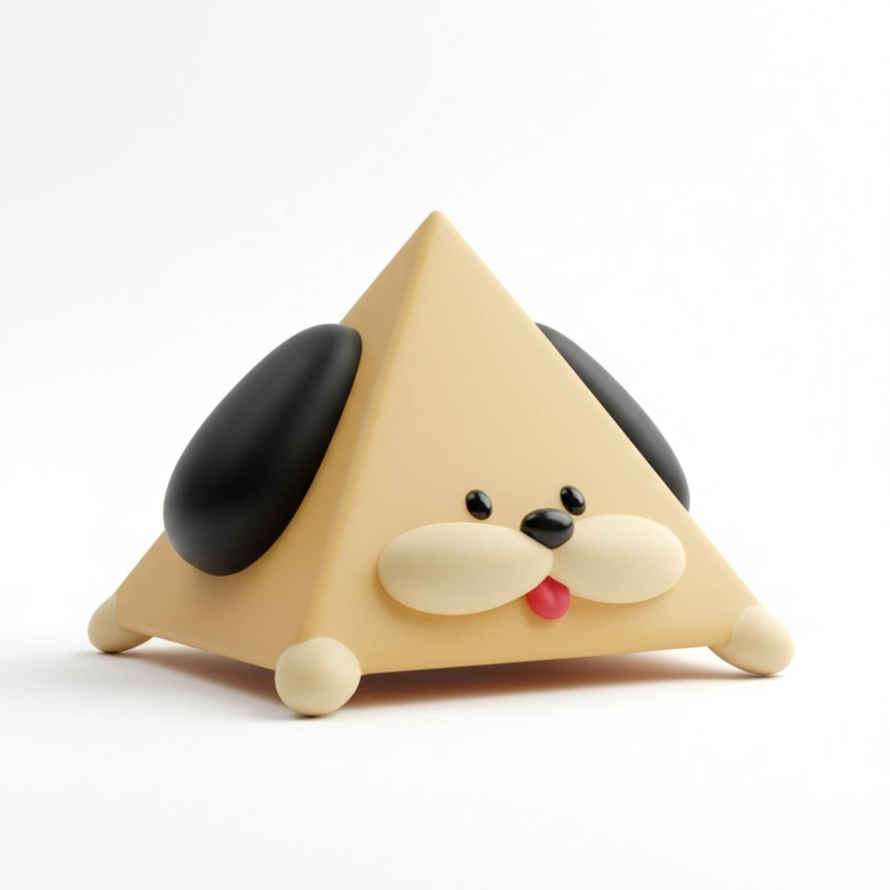

# ピラミッド犬 〜いやしのまきば〜

オリジナルキャラクター「ピラミッド犬」が草原でのんびり暮らす、癒し系ブラウザアプリ。



## あそびかた

- ピラミッド犬は勝手にぴょこぴょこ歩き回ったり、ひるねしたりします
- **タップ / クリック** … ジャンプしてよろこびます(鳴き声つき)
- **ながおし** … なでなで(♪ が出てうっとりします)
- **👀 こっちむいて** … こちらを向いてくれます
- **🐾 おいで** … カメラの近くまで来てくれます
- **🍎 りんご** … りんごをあげると食べます(しゃくしゃく)
- たまに吹き出しで話しかけてきます

> 設計の全体像は [DESIGN.md](DESIGN.md) を参照。このブランチのモデルは Tripo3D 製で、
> 現在は手編集済みの `blender/piramidog_tripo_self.blend` から書き出しています。
- ドラッグでカメラを回転、ピンチ/ホイールでズームできます
- 右上の 🔊 ボタンで BGM・効果音のオン/オフ

## 起動方法

ローカルサーバーで `index.html` を配信するだけです(ビルド不要)。

```sh
python3 -m http.server 8642
# → http://localhost:8642 を開く
```

## しくみ

- **3Dモデル(Tripo self版)**: Tripo3D 生成モデルを `blender/build_from_tripo.py` でアプリ用に変換した後、`blender/piramidog_tripo_self.blend` で本体を `InnerBody` のみに手編集している。アプリ用の `assets/piramidog.glb` は `blender/export_tripo_self.py` でこの blend から書き出す。
- **アニメーション**: ステートマシン(idle / walk / sleep / react)+ 毎フレームの手続き的アニメ(ホッピング、スクワッシュ&ストレッチ、まばたき、耳ぱたぱた)。GLB内の名前付きノード(EarL / EyeL / Tongue など)をコードから直接動かす
- **サウンド**: 音源ファイルなし。Web Audio API でオルゴール風ペンタトニックBGM・コードパッド・鳴き声をすべて合成
- **吹き出し・ハート・Zzz**: 3D座標をスクリーンに投影した位置に HTML/CSS で表示

## モデルの再生成(Blender が必要)

```sh
# 手編集済みの Tripo self モデルを書き出す(assets/piramidog.glb を上書き)
/Applications/Blender.app/Contents/MacOS/Blender --background \
  --python blender/export_tripo_self.py
```

Blender GUI で確認・編集したいときは `blender/piramidog_tripo_self.blend` を開いてください。
このファイルでは元の `Body` を消し、`InnerBody` を見える本体として使います。

## ファイル構成

| ファイル | 内容 |
|---|---|
| `index.html` | エントリーポイント(Three.js は CDN の importmap で読込) |
| `main.js` | シーン・行動AI・サウンド・入力すべて |
| `style.css` | UIオーバーレイ(タイトル・吹き出し・エフェクト) |
| `assets/piramidog.glb` | Blender からエクスポートしたピラミッド犬モデル |
| `blender/piramidog_tripo_self.blend` | 手編集済みの現行モデルソース |
| `blender/export_tripo_self.py` | self blend から `assets/piramidog.glb` を書き出すスクリプト |
| `reference/` | キャラクター設定画 |
